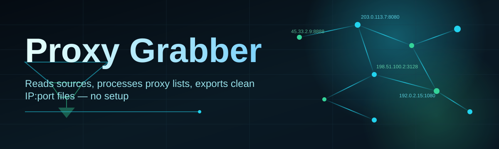
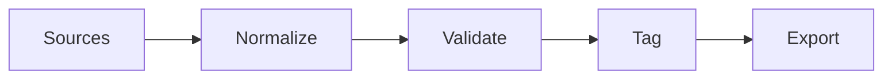

# proxy-grabber-utility 🌐⚡

  

*A tireless little scavenger that hunts, verifies, and hands you clean proxy lists — so you never have to.*

  

---

## 🔭 Overview

<strong>The origin story — click to read the full tale</strong>

 

I built **proxy-grabber-utility** because I got tired of doing the same manual ritual every single project: open eleven browser tabs, copy-paste half-dead IP:port pairs into a text file, run them through some clunky checker, watch 90% of them fail, repeat next week. It felt like archaeology when it should have felt like a button press.

So over a string of late nights fueled by coffee and stubbornness, this tool was born. It's not a corporate product with a roadmap dictated by a boardroom — it's a genuine passion project, built by someone who needed it and figured thousands of other developers, researchers, and QA engineers probably needed it too.

What started as a personal script to stop re-solving the same annoyance eventually grew into a full desktop utility with its own pipeline, its own UI, and its own opinionated way of doing things. Every design decision below exists because a lazier alternative broke something in practice.

**proxy-grabber-utility** is a standalone Windows application built for one purpose: turning the chaotic, ever-shifting world of public proxy sources into a clean, structured, *usable* list — automatically, repeatedly, and without babysitting.

If you've ever needed proxies for web scraping, load testing, geo-distributed QA, or just studying how anonymization networks behave under load, you already know the real bottleneck isn't finding a proxy list — it's finding a *good* one. Public proxy sources rot fast. An IP that worked ten minutes ago might be dead now. That volatility is the entire reason this project exists: to treat proxy grabbing as a continuous pipeline problem, not a one-time copy-paste chore.

This tool is for developers who need fresh proxy pools on demand, researchers studying network anonymity, QA teams simulating multi-region traffic, and hobbyists who just want to understand how proxy infrastructure actually behaves at scale. No accounts, no telemetry, no nonsense — just a focused utility that does its one job extremely well.

---

## 🧩 What Makes It Tick

> [!NOTE]
> Every capability below was added because a real proxy-grabbing workflow demanded it — not because it looked good on a feature list.

- **Multi-source aggregation** — pulls from a rotating set of public proxy feeds simultaneously, instead of relying on one brittle source that might disappear overnight.

- **Live validation engine** — every scraped proxy is test-connected in real time, so what lands in your export file is proven to be alive at the moment of export, not just "recently seen."

- **Protocol-aware filtering** — separates HTTP, HTTPS, SOCKS4, and SOCKS5 proxies into distinct pools, because mixing protocols into one list is how half of automation scripts quietly break.

- **Latency & geo tagging** — each verified proxy gets tagged with response time and rough geographic origin, turning a flat list into something you can actually sort and reason about.

- **Auto-refresh cycles** — set an interval and let the grabber re-scan and re-validate on its own, keeping your working pool alive instead of stale.

- **One-click export** — dump results to plain text, CSV, or clipboard in the exact format your downstream tool expects.

- **Zero-footprint design** — a single executable, no background services, no registry sprawl. Close it and it's gone.

- **Dark and light themes** — because staring at a proxy console for an hour shouldn't hurt your eyes.

> [!TIP]
> Run the auto-refresh cycle at 10-15 minute intervals for the best balance between freshness and not hammering source endpoints.

---

## 🚀 Getting Started

1. Visit the landing page using the download button above or below.

2. Grab the latest Windows build — it's a single self-contained executable.

3. Run it directly. No installer wizard, no admin prompts, no dependency chase.

4. Hit **Grab**, let validation run, then export your clean proxy list.

> [!IMPORTANT]
> Because this is a standalone `.exe`, Windows SmartScreen may flag it on first run simply because it's unsigned by a large publisher. Click "More info" → "Run anyway" if you trust the source — always verify you downloaded from the official landing page.

---

## 🖥️ System Requirements

| Requirement | Detail |
|---|---|
| OS | Windows 10 or Windows 11 (64-bit) |
| Dependencies | None — fully standalone |
| Disk space | Under 50 MB |
| Network | Active internet connection required for scraping/validation |
| Installation | Not required — portable executable |

---

## 🏗️ How It Works

The internal architecture is intentionally simple — a linear pipeline instead of a tangle of background threads guessing at each other's state:

1. **Source polling** — the grabber queries a curated set of public proxy feeds in parallel.

2. **Normalization** — raw entries (often inconsistent formats) get parsed into a unified `IP:PORT:PROTOCOL` structure.

3. **Validation pass** — each candidate proxy is test-connected against a lightweight target to confirm it's actually alive.

4. **Tagging & sorting** — surviving proxies get latency and geo metadata, then get bucketed by protocol.

5. **Export** — the final, verified pool is written out in your chosen format.

> [!WARNING]
> Validation speed depends heavily on your network conditions and the number of source feeds enabled. Running every source at once on a slow connection will noticeably lengthen the scan cycle.

---

## 🧯 Common Pitfalls

**Q: The grabber returns zero proxies — is it broken?**
Usually not. Public proxy sources sometimes go offline in bulk, or your network/firewall may be blocking outbound requests to certain feeds. Try toggling individual sources off/on.

**Q: Validation marks everything as dead, even proxies I know work elsewhere.**
Your validation target endpoint or timeout threshold may be too strict for your network latency. Increase the timeout in Settings and re-run.

**Q: Windows says the app is "unrecognized" — should I be worried?**
This is standard SmartScreen behavior for unsigned indie executables. As long as you downloaded from the official landing page linked in this README, it's safe to proceed.

**Q: Exported proxies stop working within minutes of export.**
This is expected — public proxy pools are inherently short-lived. That's precisely why the auto-refresh cycle exists; treat exports as snapshots, not permanent assets.

**Q: SOCKS5 proxies aren't showing up in my results.**
Check that SOCKS5 sources are explicitly enabled in the source panel — they're often disabled by default since fewer public feeds offer them reliably.

**Q: The app feels slow on my machine.**
Reduce concurrent source polling in Settings; running every feed simultaneously on lower-end hardware can bottleneck the validation queue.

---

## 🎛️ Interface & Experience

<strong>Keyboard shortcuts</strong>

 

| Shortcut | Action |
|---|---|
| `Ctrl + G` | Start grab cycle |
| `Ctrl + E` | Export current pool |
| `Ctrl + R` | Force refresh now |
| `Ctrl + ,` | Open Settings |
| `Esc` | Cancel active scan |

- **Themes**: Dark (default) and Light, switchable instantly from Settings without a restart.

- **Live status console**: a scrolling log shows real-time scan progress, per-source hit counts, and validation results.

- **Sortable results table**: click any column header — latency, protocol, geo — to reorder your pool on the fly.

- **Persistent settings**: your source selections, theme, and refresh interval are remembered between sessions.

---

## 🤝 Contributing & Community

This started as a solo passion project, but it grows faster with more hands on it.

> [!TIP]
> Before opening a pull request, check open issues for similar proposals — proxy source parsers change often and someone may already be mid-fix.

- Found a dead source feed? Open an issue with the feed URL and we'll retire or fix the parser.

- Have a protocol-specific improvement? PRs are genuinely welcome — this isn't a walled garden.

- Want to discuss architecture decisions? Start a discussion thread rather than a scattered comment on an old issue.

---

## 📜 License

Released under the [MIT License](LICENSE), 2026. Use it, fork it, build on it — just keep the attribution intact.

---

## ⚠️ Disclaimer

This tool aggregates and validates *publicly available* proxy information for legitimate use cases such as testing, research, and automation development. It does not host, own, or guarantee the reliability, legality, or safety of any third-party proxy it surfaces. Users are solely responsible for how they use retrieved proxies and must comply with the terms of service of any network, source, or destination they interact with.

---

